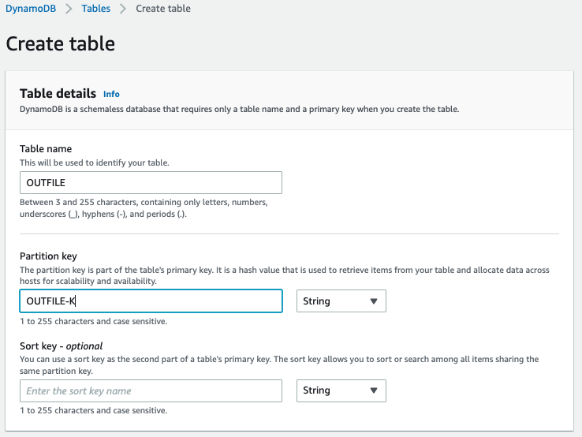

# Mainframe Data Utilities

Table of contents
=================
* Security
* License
* About
* Status
* Requirements
* Limitations
* Getting started
* Multiple layout support
* Load a DymamoDB table from local disk
* Load a DymamoDB table from s3
* How it works
* LegacyReference
* To be implemented

## Security

See [CONTRIBUTING](CONTRIBUTING.md#security-issue-notifications) for more information.

## License

This project is licensed under the Apache-2.0 License.

## About

Mainframe Data Utilities is an AWS Sample written in Python.

The purpose of this project is to provide Python scripts as a starting point for those who need to handle EBCDIC files transferred from mainframes and AS/400 platforms to AWS or any distributed environment.

The current release of this toolset consists of three scripts:

- **parse_copybook_to_json** is a module that creates a JSON parameter file by parsing Cobol Copybook. The parameter file is a description of the file EBCDIC file layout, required by extract_ebcdic_to_ascii.py 

- **extract_ebcdic_to_ascii.py** uses the JSON parameter file to slice a fixed length EBCDIC file, unpack its contents and write them to an ASCII file.

- **ebcdic.py** is the main library that handles the encoding transformation logic.

- **copybook.py** is the main library that generates a Python dictionary from COBOL copybooks.

## Status

Stable

## Requirements

Make sure [Python](https://www.python.org/downloads/) 3.8 or above is installed.

## Limitations

1. File layouts defined inside Cobol programs are not supported.
2. Packing statement is ignored when defined before the PIC clause. 
3. The file's logical record length is the sum of all field sizes. This means that in some cases the calculation may result in a size that is smaller than the physical file definition.

## Getting started

### Parsing a basic copybook

1. Clone this repo:

```
git clone git@github.com:aws-samples/mainframe-data-utilities.git.
```

2. Run the `parse_copybook_to_json.py` script to parse the [COBPACK2](LegacyReference/COBPACK2.cpy) copybook file provided in `sample-data`.

```
python3      parse_copybook_to_json.py       \
-copybook    LegacyReference/COBPACK2.cpy    \
-output      sample-data/cobpack2-list.json  \
-dict        sample-data/cobpack2-dict.json  \
-ebcdic      sample-data/COBPACK.OUTFILE.txt \
-ascii       sample-data/COBPACK.ASCII.txt   \
-print       10000                           
```

### Extracting ebcdic data to a delimiter-separated ASCII file

3. Run `extract_ebcdic_to_ascii.py`to extract the `COBPACK.OUTFILE.txt` EBCDIC file into an ASCII file.

```
python3 extract_ebcdic_to_ascii.py -local-json sample-data/cobpack2-list.json
```

4. The generated ASCCI file must martch the provided [COBPACK.ASCII.txt](sample-data/COBPACK.ASCII.txt).

## Multiple layout support

There are often multiple layouts in mainframe VSAM or sequential (flat) files. It means that you need a different transformation rule depending on the row you are reading.

The REDEFINES statement allows multiple layouts declaration in the COBOL language.

### Parsing a multiple layout copybook

The [COBKS05.cpy](LegacyReference/COBKS05.cpy) is provided in [LegacyReference](LegacyReference/) folder as an example of a VSAM file copybook having three record layouts. The [CLIENT.EBCDIC.txt](sample-data/CLIENT.EBCDIC.txt) is the EBCDIC sample that can be converted through the following steps.

1. Run the `parse_copybook_to_json.py` script to parse the copybook file provided in `sample-data`.

```
python3   parse_copybook_to_json.py     \
-copybook LegacyReference/COBKS05.cpy   \
-output   sample-data/COBKS05-list.json \
-dict     sample-data/COBKS05-dict.json \
-ebcdic   sample-data/CLIENT.EBCDIC.txt \
-ascii    sample-data/CLIENT.ASCII.txt  \
-print    20
```

### Extracting a multiple layout file

2. The step above will generate the [COBKS05-list.json](sample-data/COBKS05-list.json) with empty transformation rules: `"transf-rule"=[],`. Replace the transformation rule with the content bellow and save the `COBKS05-list.json`:

```
 "transf-rule": [
        {
            "offset": 4,
            "size": 2,
            "hex": "0002",
            "transf": "transf1"
        },
        {
            "offset": 4,
            "size": 2,
            "hex": "0000",
            "transf": "transf2"
        }
    ],
```

The parameters above will inform the `extract_ebcdic_to_ascii.py` script that records having "0002" hexadecimal value between its 5th and 6th bytes must be converted through the layout specified in "transf1" layout, whereas records that contain "0000" at the same position will be extracted with the "transf2" layout.

The result of the change above must produce a file like [COBKS05-rules.json](sample-data/COBKS05-rules.json).

3. Run `extract_ebcdic_to_ascii.py`to extract the `CLIENT.EBCDIC.txt` into an ASCII file.

```
python3 extract_ebcdic_to_ascii.py -local-json sample-data/COBKS05-list.json
```

4. Check the [CLIENT.ASCII.txt](sample-data/CLIENT.ASCII.txt) file.

## Load a DymamoDB table from local disk

### Create the DynamoDB table

1. Create the DynanamoDb table which will be loaded on next steps. In this example we defined `CLIENT` as the table name, `CLIENT-ID` as its partition key, and CLIENT-R-TYPE as its sort key.



### Parse the copybook

Run the `parse_copybook_to_json.py` script to parse the [COBKS05](LegacyReference/COBKS05.cpy) copybook file provided in `sample-data`.

 1. Inform `ddb` on `-output-type`.
 2. Inform the DynamoDB table name (created before) on `-ascii`.
 3. Inform the DynamoDB table partition key name on `-part-k-name`.
 4. Inform the DynamoDB table partition key size (as it is in the EBCDIC file) on `-part-k-len`.
 5. Inform the DynamoDB table sort key name on `-sort-k-name`.
 6. Inform the DynamoDB table sort key size (as it is in the EBCDIC file) on `-sort-k-len`.

```
python3      parse_copybook_to_json.py     \
-copybook    LegacyReference/COBKS05.cpy   \
-output      sample-data/COBKS05-ddb.json \
-ebcdic      sample-data/CLIENT.EBCDIC.txt \
-ascii       CLIENT                        \
-part-k-len  4                             \
-part-k-name CLIENT-ID                     \
-sort-k-len  2                             \
-sort-k-name CLIENT-R-TYPE                 \
-output-type ddb                           \
-print    20
```
### Set the transformatiom rules

The step above will generate the [COBKS05-ddb.json](sample-data/COBKS05-ddb.json) with empty transformation rules: `"transf-rule"=[],`. Replace the transformation rule with the content bellow and save the `COBKS05-ddb-rules.json`:

```
 "transf-rule": [
        {
            "offset": 4,
            "size": 2,
            "hex": "0002",
            "transf": "transf1"
        },
        {
            "offset": 4,
            "size": 2,
            "hex": "0000",
            "transf": "transf2"
        }
    ],
```

### Load the data into the CLIENT Dynamodb table

1. Run `extract_ebcdic_to_ascii.py`to extract the [CLIENT.EBCDIC.txt](sample-data/CLIENT.EBCDIC.txt) and load into the `CLIENT` Dynamodb table in the ASCII encoding.

```
python3 extract_ebcdic_to_ascii.py -local-json sample-data/COBKS05-ddb-rules.json
```

## Load a DymamoDB table from s3

### Parse the copybook

Run the `parse_copybook_to_json.py` script to parse the copybook file provided in `sample-data`.

1. Inform `ddb` as the value the `-output-type` value.
2. Inform the name of the DynamoDB table (created before) name as the `-ascii`value.
3. Inform the name of the DynamoDB table key name as the `-keyname` value.
4. Inform the length of the key of the ebcdic input file as the `-keylen` value.
5. The `-ebcdic` value must contain the EBCDIC file S3 URI

```
python3      parse_copybook_to_json.py              \
-copybook    LegacyReference/COBPACK2.cpy           \
-output      sample-data/cobpack2-list-ddb-s3.json  \
-ebcdic      s3://yourbucket/COBPACK.OUTFILE.txt    \
-ascii       OUTFILE                                \
-print       1000                                   \
-keylen      19                                     \
-keyname     OUTFILE-K                              \
-output-type ddb                                    \
-req-size    25
```

### Data load (locally triggered)

1. Run `extract_ebcdic_to_ascii.py`to extract the `COBPACK.OUTFILE.txt` and load into the `OUTFILE` Dynamodb table in the ASCII encoding.

```
python3 extract_ebcdic_to_ascii.py -local-json sample-data/cobpack2-list-ddb-s3.json
```

### Data load (triggered from Lambda)

1. Create an S3 bucket and folder that will receive the input EBCDIC file.
2. Create a the `layout/` folder inside the bucket/folder previously created.
3. Create the DynamoDB table that will receive the converted data. 
   * The table name must be `OUTFILE` (same as provided in the `-ascii` parameter of the `parse_copybook_to_json.py` script)
   * The table key must be `OUTFILE-K` (same as provided in the `-keyname` parameter of the `parse_copybook_to_json.py` script)
   * To process the contents of the sample file choose 300 as the minimum write capacity and 400 as the maximum.
4. Create a Python 3.8 (or above) Lambda function and assign a role with:
   * Read access to the source data S3 bucket
   * Write access to the target DynamoDb table
5. Create a zip file with the Python code and upload it into the Lambda function
   ```
   zip mdu.zip *
   ```
6. Change the Lambda funcion 'Handler' from `lambda_function.lambda_handler` to `extract_ebcdic_to_ascii.lambda_handler` at the Runtime settings section.
7. Rename the `sample-data/cobpack2-list.json` to `COBPACK.json` and upload it to the `/layout` folder created on step 2.
8. Create a new Lambda test event with the contens of `sample-data/COBPACK-TEST.json` 
9. Replace the `example-bucket` by the bucket name created on step 1 and trigger the event.

## How it works

### parse_copybook_to_json

Mainframe files are typically packed (into decimal and binary formats), and encoded in EBCDIC. 

To make the extraction possible it's important to slice the source file according to its layouts and data types. This module is an automation that reads the file's layout from a Cobol copybook and creates a JSON file that holds the information required to interpret and extract the data from the source file.

#### Arguments

The arguments below are supported by this function:

|Parameter  |Type    |Description                                                                    |
|-----------|--------|-------------------------------------------------------------------------------|
| -copybook |Required| Path of the copybook file to be processed                                     |
| -output   |Required| Path of the JSON file to be generated                                         |
| -ebcdic   |Optional| Informs the name of the ebcdic file that will be processed by the next script |
| -ascii    |Optional| Informs the name of the ascii  file that will be processed by the next script |
| -print    |Optional| Changes the print frequency of the next script                                |
| -dict     |Optional| Generates output nested JSON file to be used as a documentation               |

#### Output

This script generates a JSON file that holds **general parameters** and **layout transformation parameters** as its output.

|Parameter      |Description                                           |
|---------------|------------------------------------------------------|
|input          |Name of the input EBCDIC file to be extracted         |
|output         |Name of the output ASCII file to be generated         |
|max            |Max number of records to be extracted                 |
|skip           |Number of records to be skipped                       |
|print          |Number of records before print status                 |
|lrecl          |Logical record length of the ebcdic file              |
|rem-low-values |Remove null chars                                     |
|separator      |Char to add between fields to separate them           |
|transf-rule    |Rules for layout section within a multi-layout file  |
|transf         |List of the transformation fields (layout)            |
|transf.type    |type of the field to be transformed                   |
|transf.bytes   |Size in bytes of the field to be transformed          |
|transf.name    |Name of the field to be transformed                   |

Sample:
```
   "input": "extract-ebcdic-to-ascii/COBPACK.OUTFILE.txt",
   "output": "extract-ebcdic-to-ascii/COBPACK.ASCII.txt",
   "max": 0,
   "skip": 0,
   "print": 10000,
   "lrecl": 150,
   "rem-low-values": true,
   "separator": "|",
   "transf-rule": [],
   "transf": [
      {
         "type": "ch",
         "bytes": 19,
         "name": "OUTFILE-TEXT"
      }
```

The length is represented in bytes. An 18-digit integer field, for instance, only takes 10 bytes. For more information check [IBM Computational items documentation](https://www.ibm.com/docs/en/cobol-zos/4.2?topic=clause-computational-items).

#### Supported data types

The supported data types are created as follows:

| Parameter | Meaning              |Legacy Notation |
|-----------|----------------------|----------------|
| ch        | text                 | PIC  x         |
| zd        | zoned                | PIC  9         |
| zd+       | signed zoned         | PIC S9         |
| bi        | binary               | PIC  9 COMP    |
| bi+       | signed binary        | PIC S9 COMP    |
| pd        | packed-decimal       | PIC  9 COMP-3  |
| pd+       | signed packed-decimal| PIC S9 COMP-3  |

### extract-ebcdic-to-ascii

Once the Cobol copybook is parsed to JSON it can be used as the input of this module.

Both **input** (EBCDIC) and **output** (ASCII) files are identified by the JSON file.

```
   "input":  "extract-ebcdic-to-ascii/COBPACK.OUTFILE.txt",
   "output": "extract-ebcdic-to-ascii/COBPACK.ASCII.txt",
```

## LegacyReference 

The source code under the *LegacyReference* folder are JCL and Cobol components created exclusively to generate EBCDIC data mass for testing purposes.

The [layout](LegacyReference/COBPACK2.cpy) of the [source file](sample-data/COBPACK.OUTFILE.txt) used for testing (in Cobol notation) is:

```
01 REC-OUTFILE.                                                 
   03 OUTFILE-TEXT                PIC -9(18).                    
   03 OUTFILE-UNPACKED            PIC  9(18).                    
   03 OUTFILE-UNPACKED-S          PIC S9(18).                    
   03 BINARY-FIELDS.                                           
      05 OUTFILE-COMP-04          PIC  9(04) COMP.               
      05 OUTFILE-COMP-04-S        PIC S9(04) COMP.               
      05 OUTFILE-COMP-09          PIC  9(09) COMP.               
      05 OUTFILE-COMP-09-S        PIC S9(09) COMP.               
      05 OUTFILE-COMP-18          PIC  9(18) COMP.               
      05 OUTFILE-COMP-18-S        PIC S9(18) COMP.               
   03 PACKED-DECIMAL-FIELDS.                                  
      05 OUTFILE-COMP3-04         PIC  9(04) COMP-3.             
      05 OUTFILE-COMP3-04-S       PIC S9(04) COMP-3.             
      05 OUTFILE-COMP3-09         PIC  9(09) COMP-3.             
      05 OUTFILE-COMP3-09-S       PIC S9(09) COMP-3.             
      05 OUTFILE-COMP3-18         PIC  9(18) COMP-3.             
      05 OUTFILE-COMP3-18-S       PIC S9(18) COMP-3.             
   03 GROUP1.
      05 GROUP1-1 OCCURS 2 TIMES.                                 
         07 TEXT1                 PIC  X(01).                     
   03 GROUP2 REDEFINES GROUP1.
      05 TEXT2                    PIC  X(02).                    
   03 FILLER                      PIC  X(29).                   
```

## To be implemented

### Copybook parser
- Aurora schema parser (DDL)
- Add similar packing statements (BINARY, PACKED-DECIMAL...)
- Handle packing statement (COMP, COMP-3, etc.) when declared before PIC statement

### Data conversion

- Aurora data load